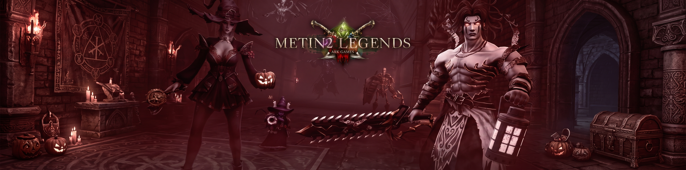

<div align="center">

# ⚔️ METIN2 LEGENDS — CADASTRO & DOWNLOAD ⚔️

*Landing page épica de cadastro de contas e download do cliente para o servidor Metin2 Legends.*

[](LICENSE)
[](index.html)
[](style.css)
[](script.js)

[Sobre](#-sobre-o-projeto) • [Funcionalidades](#-funcionalidades) • [Como Rodar](#-como-executar-localmente) • [Customização](#-guia-de-customização)

---



</div>

## 📖 Sobre o Projeto

O **Metin2 Legends Register** é uma página web desenvolvida sob medida para a captação e registro de novos jogadores em servidores privados de Metin2. 

Desenvolvido com uma estética **Dark Fantasy** imersiva (tons carmesim, dourado e preto ônix), o projeto entrega uma experiência de usuário polida, moderna e totalmente responsiva, permitindo coletar os dados de novos cadastros diretamente através de uma planilha do **Google Sheets via Google Forms**, sem a necessidade de um backend dedicado complexo.

---

## ✨ Funcionalidades

- **🎨 Tema Dark Fantasy Épico:**
  - Tipografia imersiva com fontes *Cinzel* e *Inter*.
  - Paleta com brilho carmesim, detalhes dourados e estética inspirada em MMORPGs clássicos.
  - Animações e micro-interações suaves em inputs e botões.

- **🛡️ Validação Completa em Tempo Real:**
  - **Origem do Jogador:** Seleção obrigatória de como conheceu o servidor para métricas de marketing.
  - **Login:** 4 a 8 caracteres, alfanumérico e `_`, com tooltip explicativo acessível via hover e toque.
  - **Senha:** Mínimo de 6 caracteres.
  - **E-mail:** Validação de formato de e-mail válido.
  - **Código Safebox:** Código de segurança do armazém e deleção de personagem (4 a 7 caracteres).

- **📡 Integração Serverless com Google Forms:**
  - Envio assíncrono via `fetch` (`no-cors`) diretamente para a API de resposta de formulários do Google.
  - Armazenamento automático e organizado das respostas em planilha online.

- **💬 Feedback Dinâmico via Modal:**
  - Modal customizado para mensagens de sucesso e aviso de erros, acessível por teclado (`Esc`) e clique externo.

- **📥 Call to Action de Download:**
  - Seção em destaque com botão temático para baixar o cliente do jogo.

- **📱 Design Totalmente Responsivo:**
  - Adaptado para smartphones, tablets e monitores ultrawide.

---

## 🛠️ Tecnologias Utilizadas

- **HTML5:** Semântico e estruturado para acessibilidade (ARIA labels, tooltips).
- **CSS3:** Custom Properties (variáveis de tema), Flexbox, CSS Grid, filtros de vidro e gradientes radiais.
- **JavaScript (ES6+):** Manipulação de DOM, regex de validação, tratamento de eventos e `fetch API`.

---

## 📂 Estrutura do Repositório

```plaintext
metin2-legends-register/
├── banner.jpg        # Banner épico do topo da página
├── favicon.ico       # Ícone de aba do navegador
├── index.html        # Estrutura semântica e formulário de cadastro
├── script.js         # Lógica de validação, modal e envio assíncrono
├── style.css         # Estilos, variáveis e design system dark fantasy
└── README.md         # Documentação do projeto
```

---

## 🚀 Como Executar Localmente

Você não precisa de dependências externas ou gerenciadores de pacotes (npm/yarn) para testar o projeto:

1. **Clone o repositório:**
   ```bash
   git clone git@github.com:AlissonWenceslau/metin2-legends-register.git
   cd metin2-legends-register
   ```

2. **Abra o projeto:**
   - **Opção 1:** Dê um duplo clique no arquivo `index.html`.
   - **Opção 2 (Recomendada):** Utilize a extensão **Live Server** no VS Code ou suba um servidor HTTP simples:
     ```bash
     # Usando Python 3
     python -m http.server 3000
     ```
   - Acesse no navegador: `http://localhost:3000`.

---

## ⚙️ Guia de Customização

### 1. Conectar seu próprio Google Forms
No arquivo `script.js`, substitua o endpoint:
```javascript
const GOOGLE_FORM_URL = "https://docs.google.com/forms/d/e/SEU_FORM_ID/formResponse";
```
E certifique-se de atualizar os atributos `name="entry.XXXXXX"` em cada campo do `index.html` com os IDs correspondentes às perguntas do seu formulário.

### 2. Link de Download do Cliente
No `index.html`, atualize a propriedade `href` do elemento `#btnDownload`:
```html
<a id="btnDownload" class="btn-download" href="SEU_LINK_DO_CLIENTE_AQUI" target="_blank" ...>
```

### 3. Redes Sociais no Rodapé
Altere as URLs das tags `<a>` dentro da classe `.footer-links` no rodapé do `index.html` para apontar para o Discord, YouTube e Instagram oficiais do seu servidor.

---

## ⚖️ Declaração Legal / Disclaimer

> **Aviso:** Metin2 é uma marca registrada de seus respectivos detentores de direitos autorais (Ymir Entertainment / Webzen / Gameforge). Este projeto é uma iniciativa independente voltada para servidores privados da comunidade e não possui afiliação oficial com os detentores dos direitos.

---

## 👤 Autor

Desenvolvido por **[Alisson Wenceslau](https://github.com/AlissonWenceslau)**.
